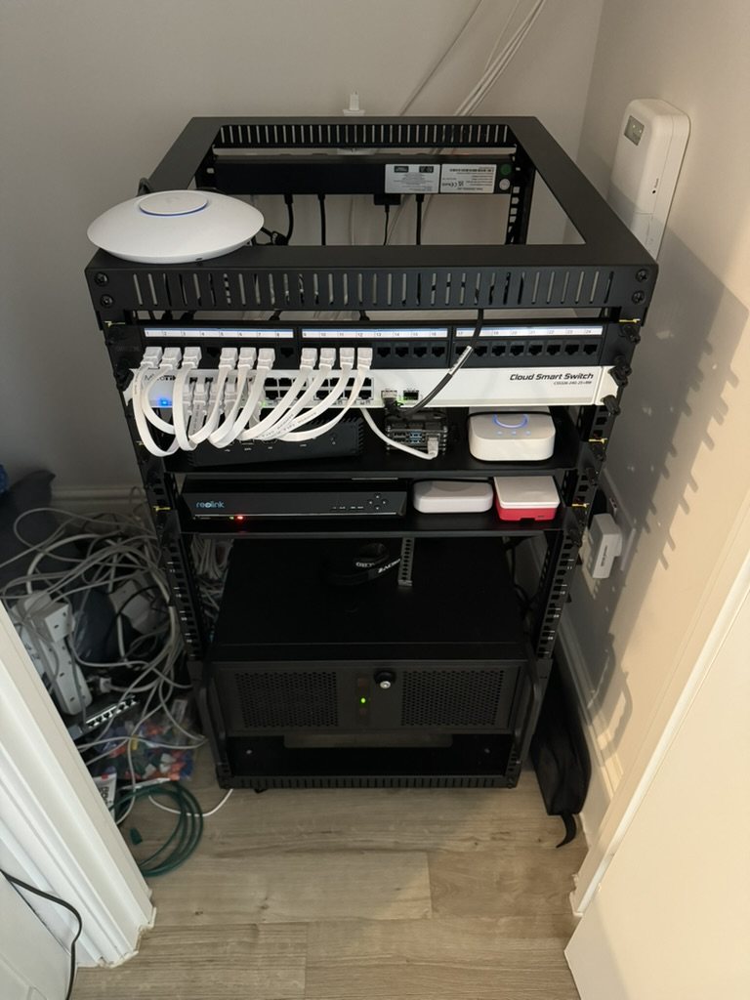

+++
date = '2024-11-10T20:49:20Z'
draft = false
title = 'Rented Servers to Self Hosting everything'
+++

For many years (on/off) I've rented dedicated servers from the likes of OVH. This has many advantages over typical shared VPS hosting as your processes don't need to compete for CPU time with other tenants on the hypervisor. At the start of the year however, I decided to build my own Home Server and move away from a rented solution.

---
# The Build

Spec wise, I went with the following:
- Motherboard: MSI B550-A PRO
- Case: Codegen 4U Rackmount V2 Server Case
- NVME Storage: 2x 1TB Samsung 980 PRO
- PSU: 550W Corsair CV Series CV550
- Memory: 64GB DDR4 Memory
- HDD: 2 x 16TB WD Red

Given the amount of CPU & Memory at my disposal, I chose to install the open source hypervisor [Proxmox](https://www.proxmox.com/en/). Proxmox allows for running both containers & VMs.

Heres a photo of what my home rack looked like:

---

# Networking
If you decide to self host services from a residential ISP connection, you'll soon run into issues. Whether it's having to use some sort of Dynamic DNS service if you haven't got a static public IP or needing more IPs in general. You may even have ingress issues accessing ports like 80, 443, 589 or (very common) 25.

Fortunately my ISP assigns static IPs to customers, however I needed more and this wasn't something I could obtain without going down more expensive business plans. The solution? L2TP tunnel from [A&A](https://www.aa.net.uk/broadband/l2tp-service/). For around £18 a month I was able to get assigned my own /29 with control over the PTR records (reverse DNS). L2TP is not a VPN - it's just an unencrypted tunnel where data packets are encapsulated and forwarded to you. Typically for encryption you'd run something like IPSEC within the tunnel. As the name suggests, it runs on Layer 2 (Data Link) of the [OSI Model](https://www.geeksforgeeks.org/open-systems-interconnection-model-osi/).

Why did I need more IPs? The main reason being that I wanted to run my own mail server, and I couldn't really do that from a residential IP (Blacklists, spam issues etc..). Another being that I wanted to run multiple services such as Caddy/Treafik for ingress HTTP traffic and have a static IP assigned to that ingress proxy.

---

# Power
If you've seen the power prices in the UK, you wont be surprised to know that it cost me ~£35 a month to run this server 24/7. We do occasionally get power cuts, so to avoid data loss & memory issues I managed to get a Eaton 5PX 1500 UPS off eBay. This UPS is powerful enough to keep my entire rack powered for around 20mins, which is pretty cool. Safe to say, with this in the rack my hosts uptime was very stable. In the event of a long power outage, it would automatically shutdown services.

---

# Was it all worth it?
Yes & No. Given it was costing me ~£35 for power and around £18 for IPs a month, I've actually moved the server into Datacenter (more details in next post). I've built a great server whith more capacity that I know what to do with & I've gained a great UPS which will now power my home rack (without the server) for well over an hour. I no longer have to worry about the server getting too hot and causing a fire whilst we're not in (or asleep :D).

tldr; Built an awesome server with more power that I know what to do with, cost a lot to run at home so ended up paying more to move it into a datacenter.
